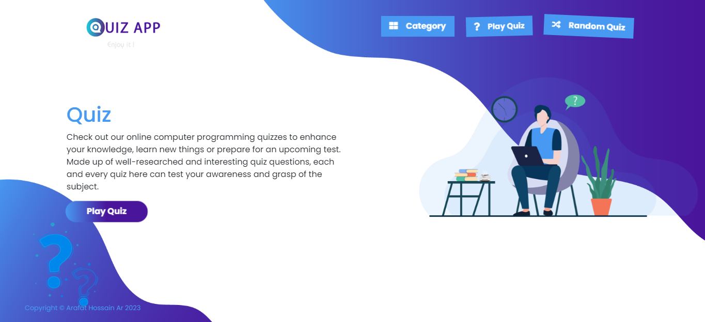
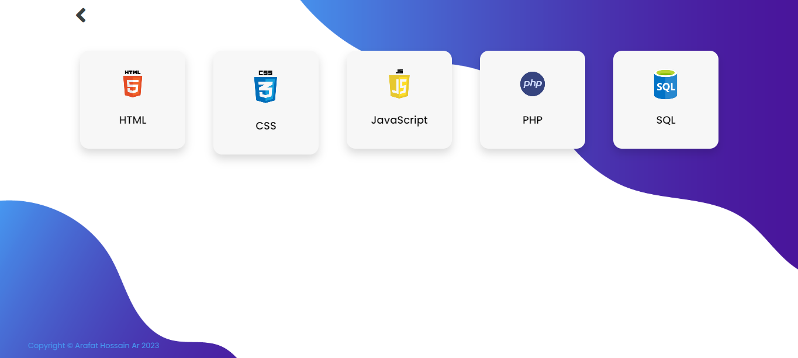
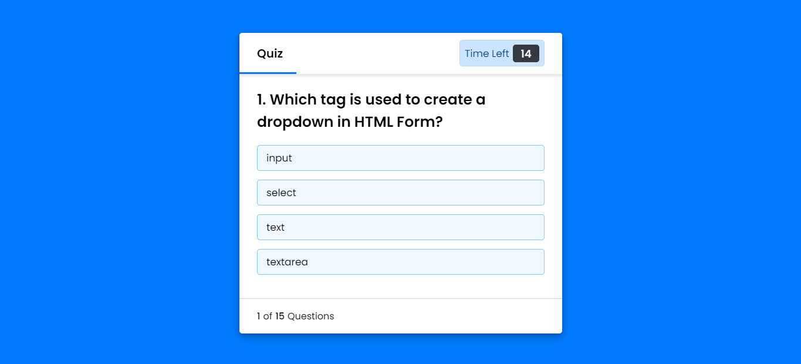

# Quiz-app-Play-Quiz-App
 Play Quiz Programming online. Built with latest (v9) Laravel Framework

   

# Getting started

## Installation

Please check the official laravel installation guide for server requirements before you start. [Official Documentation](https://laravel.com/docs/9.x)

Clone the repository

    git clone https://github.com/arafat-web/Quiz-app.git

Switch to the repo folder

    cd Quiz-app

Install all the dependencies using composer

    composer install

Copy the example env file and make the required configuration changes in the .env file

    cp .env.example .env

Generate a new application key

    php artisan key:generate

Generate a new JWT authentication secret key

    php artisan jwt:generate

Run the database migrations (**Set the database connection in .env before migrating**)

    php artisan migrate

Start the local development server

    php artisan serve

You can now access the server at http://localhost:8000

# Screenshots

Home

 

Categories
 

 Quiz
 

 

 # Thanks